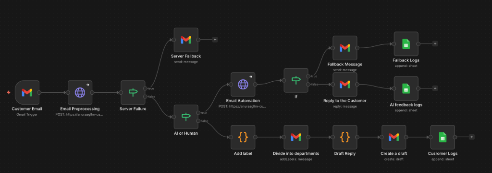

# 🤖 TechGear — AI Customer Support Agent

> An intelligent, end-to-end email support system that **reads**, **understands**, and **replies** to customer emails automatically — or escalates to a human when it should.


## 📺 Demo

🎬 **[Watch the full demo video →](https://drive.google.com/file/d/1Is5FX_jLufm2EtXdaQNxvHVfvZ0fituc/view?usp=sharing)**

🌐 **Live Backend:** [https://anuraagllm-customer-support-agent.hf.space](https://anuraagllm-customer-support-agent.hf.space)

---

## ⚙️ How It Works

The system is orchestrated via **Make.com** (formerly Integromat). When a customer email arrives in Gmail, the automation pipeline kicks in:



**Pipeline at a glance:**

1. **Gmail Trigger** — A new customer email arrives.
2. **Email Preprocessing** — The email is sent to the FastAPI backend for cleaning, NER, intent classification, and routing.
3. **Server Failure Check** — If the backend is down, a fallback email is sent and the event is logged.
4. **AI or Human?** — Based on the routing decision:
   - **AI Route →** The RAG engine generates a policy-grounded reply, which is sent back to the customer. The interaction is logged to Google Sheets.
   - **Human Route →** The email is labelled, routed to the correct department, and a draft reply is created for a human agent. The event is logged separately.

---

## ✨ Key Features

| Feature | Details |
|---|---|
| **Email Preprocessing** | Cleans signatures & disclaimers · Detects language · Extracts entities (name, order ID, SKU, VIN) |
| **Intent Classification** | Zero-shot via `facebook/bart-large-mnli` — warranty, refund, shipping, billing, etc. |
| **Smart Routing** | Auto-replies to simple queries · Escalates critical or complex cases to humans |
| **Department Detection** | Keyword-boosted zero-shot classification across 9 product departments |
| **RAG Engine** | Hybrid retrieval (BM25 + ChromaDB) with cross-encoder reranking → `Qwen2.5-72B-Instruct` |
| **Policy-Grounded Replies** | Responses are strictly derived from the knowledge base — no hallucination |
| **Escalation Handling** | Graceful handoff to human support for out-of-scope or high-risk queries |

---

## 🏗️ Architecture

```
Incoming Email
     │
     ▼
┌─────────────┐    ┌──────────────────┐    ┌────────────────┐
│  Preprocess  │──▶│ Intent & Routing  │──▶│   RAG Engine   │
│  (clean,     │    │  Classification   │    │  (retrieve +   │
│   NER, lang) │    │  (zero-shot LLM)  │    │  rerank + LLM) │
└─────────────┘    └──────────────────┘    └────────────────┘
                            │                       │
                    Human Escalation          Email Reply
```

**RAG Pipeline:**

1. **Ingest** — PDF FAQ → chunked → embedded with `BAAI/bge-large-en-v1.5` → stored in ChromaDB
2. **Retrieve** — BM25 (lexical) + ChromaDB (semantic) ensemble retrieval
3. **Rerank** — `cross-encoder/ms-marco-MiniLM-L-6-v2` scores and reorders results
4. **Generate** — Top-3 chunks → prompt → `Qwen2.5-72B-Instruct` → formatted email reply

---

## 🚀 Getting Started

### Prerequisites

- Python 3.10+
- A [HuggingFace](https://huggingface.co) account with an API token (inference access)

### Installation

```bash
# Clone the repo
git clone https://github.com/choppadandianuraag/customer-support-agent.git
cd customer-support-agent

# Create & activate a virtual environment
python -m venv venv
source venv/bin/activate   # Windows: venv\Scripts\activate

# Install dependencies
pip install -r requirements.txt

# Download spaCy model
python -m spacy download en_core_web_sm
```

### Configuration

```bash
cp .env.example .env
```

Edit `.env` with your credentials:

```env
HF_TOKEN=your_huggingface_token_here      # Required
GOOGLE_API_KEY=your_google_api_key_here    # Optional
PDF_PATH=/path/to/your/faqdata.pdf        # Optional — defaults to ./faqdata.pdf
```

> **Note:** Place your FAQ knowledge base PDF as `faqdata.pdf` in the project root, or set `PDF_PATH` in `.env`.

### Run Locally

```bash
uvicorn main:app --reload
```

The API will be available at **http://localhost:8000**
Interactive docs at **http://localhost:8000/docs**

---

## 📡 API Endpoints

### `GET /` — Health Check

Returns `{"message": "Running 🚀"}`.

---

### `POST /preprocess` — Analyse an Email

Cleans and analyses an incoming email **without** generating a reply.

<details>
<summary><strong>Example Request & Response</strong></summary>

**Request:**
```json
{
  "subject": "Issue with my order",
  "body": "Hi, I haven't received my order ORD-12345 yet...",
  "sender": "customer@example.com",
  "timestamp": "2024-01-15T10:30:00Z"
}
```

**Response:**
```json
{
  "cleaned_body": "...",
  "language": "en",
  "entities": { "order_id": "ORD-12345" },
  "intent": "shipping issue",
  "confidence": 0.87,
  "route": "general",
  "route_reason": "known issue category with sufficient confidence",
  "department": null,
  "department_confidence": null
}
```
</details>

---

### `POST /generate-reply` — Full Pipeline

Preprocess → Route → RAG reply (or human escalation).

<details>
<summary><strong>Example Responses</strong></summary>

**Auto-replied:**
```json
{
  "preprocess": { "..." },
  "reply": "Re: Issue with my order\n\nHi John, ...",
  "confidence": 0.91,
  "status": "success"
}
```

**Escalated:**
```json
{
  "preprocess": { "..." },
  "reply": "Escalated to human support: potentially complex or critical content",
  "status": "escalated"
}
```
</details>

---

## 📁 Project Structure

```
.
├── main.py             # FastAPI app — endpoints & RAG engine init
├── preprocessing.py    # Email preprocessing — cleaning, NER, classification, routing
├── rag_engine.py       # RAG engine — embeddings, vector store, reranker, LLM chain
├── requirements.txt    # Python dependencies
├── Dockerfile          # Container configuration
├── .env.example        # Environment variable template
├── faqdata.pdf         # Knowledge base PDF (not tracked in git)
└── assets/
    └── workflow.png    # Make.com automation workflow diagram
```

---

## 🔑 Environment Variables

| Variable | Required | Description |
|---|---|---|
| `HF_TOKEN` | ✅ Yes | HuggingFace API token for LLM inference |
| `GOOGLE_API_KEY` | ❌ No | Google Gemini API key (if using Gemini models) |
| `PDF_PATH` | ❌ No | Path to FAQ PDF — defaults to `./faqdata.pdf` |

---

## 🧰 Tech Stack

| Layer | Technology |
|---|---|
| API Framework | FastAPI |
| NLP / NER | spaCy (`en_core_web_sm`) |
| Intent Classification | HuggingFace Transformers (`facebook/bart-large-mnli`) |
| Embeddings | `BAAI/bge-large-en-v1.5` via LangChain |
| Vector Store | ChromaDB |
| Lexical Search | BM25 |
| Reranker | `cross-encoder/ms-marco-MiniLM-L-6-v2` |
| LLM | `Qwen/Qwen2.5-72B-Instruct` via HuggingFace Inference API |
| Orchestration | LangChain |
| Automation | Make.com (Gmail + Google Sheets integration) |

---

## 📄 License

MIT
